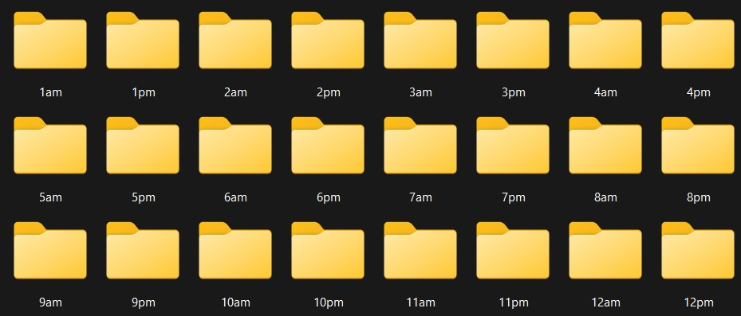
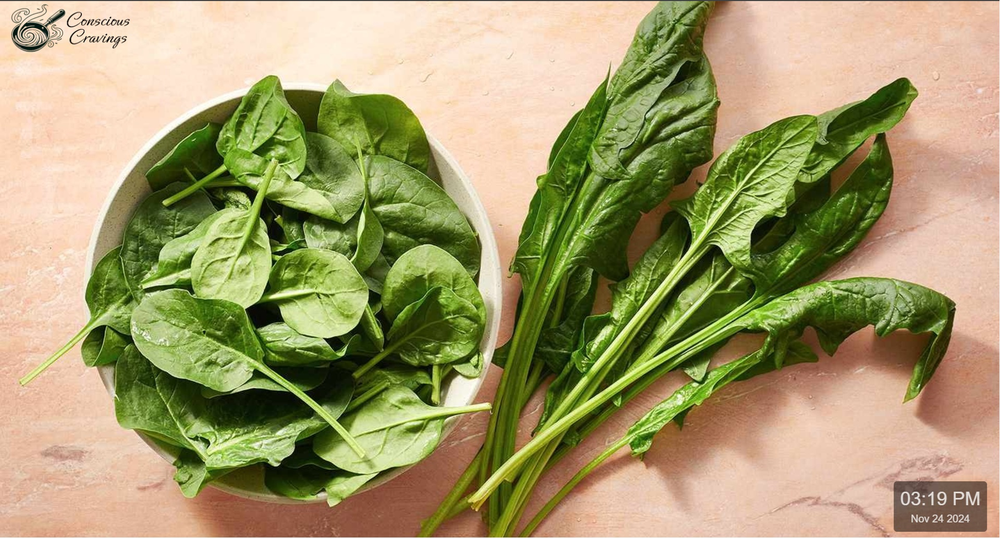

🍽️ Welcome to Conscious Cravings - where you get to curate a world where your cravings are aligned with your wellness goals. Let's take the concept of "selfertising" and present yourself with a personal, always-on visual reminder of the foods _you_ choose to inspire you.

🥗 Let your selections guide you toward mindful choices, turning conscious cravings into powerful, everyday actions. Find out how the simple power of imagery transforms your relationship with what you eat.

🚀 The best part is, that our app can be used just about any way you want! Feel free to display motivational quotes, family photos, or NLP-inspired affirmations for every hour of the day!

[promotional video](https://youtu.be/uQ1Y6w5KGiA)

# 🛠️ Installation and Usage

We provide two ways to deploy Conscious Cravings:

1. Cloning the GitHub repository

2. Using the prebuilt Docker Hub image

# Option 1: Clone and Build from GitHub
## Requirements:
- Docker
- Git

## Steps:
1. Clone the GitHub repository:

`git clone https://github.com/your-username/conscious-cravings.git`
`cd conscious-cravings`

2. Build the Docker image locally:

`docker build -t conscious-cravings .`

3. Run the container:

`docker run -p 8000:8000 -v $(pwd)/images:/app/images conscious-cravings` (on Linux)
`docker run -p 8000:8000 -v images:/app/images conscious-cravings` (in Windows)

4. Access the app in your browser:

- Open: http://127.0.0.1:8000/

# Option 2: Pull Prebuilt Image from Docker Hub

## Steps:

1. Pull the prebuilt Docker image:

`docker pull markraidc/conscious-cravings:latest`

2. Run the container:

`docker run -p 8000:8000 -v /images:/app/images your-dockerhub-username/conscious-cravings`

3. Navigate to:

- http://127.0.0.1:8000/

# ⚙️ Configuration

- Drop photos of your choosing for any hour you'd like:

- Click on the Conscious Cravings logo on the top left to set the image change interval

# 💁🏻 Need help? Comments? Suggestions?

- markraidc@gmail.com

